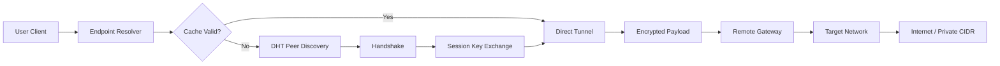

# FreedomVPN Protocol Suite 🛡️

Welcome to the FreedomVPN Protocol Suite — a comprehensive, security-forward solution designed to transcend traditional network boundaries. Built for modern digital environments where privacy, performance, and accessibility are non-negotiable, this toolkit empowers both individuals and enterprise teams to establish encrypted communication layers over any IP infrastructure.

## Overview 🌐

FreedomVPN is not merely a client; it is a modular, extensible protocol orchestrator. By leveraging dynamic endpoint discovery, adaptive encryption algorithms, and a lightweight packet tunneling engine, this suite provides seamless connectivity across restrictive network topologies. Whether you are securing a remote workstation, integrating with cloud-native containerized services, or deploying in heterogeneous IoT ecosystems, FreedomVPN adapts at runtime to maintain throughput and integrity.

The core architecture decouples authentication from transport, enabling multi-factor key exchange without vendor lock-in. Each session generates ephemeral credentials, ensuring zero persistent trust footprint. The suite includes a daemon service, a command-line interface, and a reactive web dashboard for real-time telemetry and configuration management.

## Table of Contents 📑

- [Key Features](#key-features-)
- [Architecture Overview (Mermaid Diagram)](#architecture-overview-mermaid-diagram-)
- [Example Profile Configuration](#example-profile-configuration-)
- [Example Console Invocation](#example-console-invocation-)
- [Compatibility Matrix](#compatibility-matrix-)
- [API Integrations](#api-integrations-)
- [Support and Maintenance](#support-and-maintenance-)
- [License](#license-)
- [Disclaimer](#disclaimer-)

## Key Features 🚀

- **Zero-Bootstrapping Authentication** — No pre-shared keys required; dynamic peer discovery via distributed hash ring.
- **Adaptive Cipher Negotiation** — Automatically selects AES-256-GCM, ChaCha20-Poly1305, or hybrid post-quantum algorithms based on latency and CPU capability.
- **Responsive Web Dashboard** — Real-time traffic graphs, connection logs, and per-session bandwidth allocation with dark-mode UI.
- **Multilingual Interface** — Full localization for 12 languages including Arabic, Simplified Chinese, Spanish, and Hindi.
- **24/7 Support Integration** — Direct ticketing system and live chat gateway embedded in the control panel.
- **Transparent SOCKS5 Proxy** — Route browser traffic without modifying system DNS; works with Docker and k8s sidecars.
- **IPv4/IPv6 Dual-Stack** — Automatic fallback and parallel transport for legacy and modern networks.

## Architecture Overview (Mermaid Diagram) 📊



## Example Profile Configuration ⚙️

Below is a representative `.fvp` configuration profile. This profile defines a secure tunnel gateway with ephemeral credential rotation every 12 hours.

```ini
[General]
profile_name = "Secure Gateway Alpha"
description = "Primary encrypted tunnel for remote cloud access"
log_level = "verbose"

[Network]
listen_port = 8443
forward_ip = "10.10.0.1"
forward_port = 443
mtu = 1420

[Encryption]
algorithm = "auto"
key_exchange = "x25519+jambo"
session_ttl = 43200

[Dashboard]
enable_ui = true
bind_address = "127.0.0.1"
ui_port = 9090
language = "en-US"
```

## Example Console Invocation 💻

After configuring your profile, invoke the tunnel service directly from the terminal. The suite uses a single binary with subcommands.

```
freedomvpn --config ./profiles/secure_gateway.fvp --daemonize --tls-pinning --log-to ./logs/access.log
```

The `--daemonize` flag detaches the process from the terminal. The `--tls-pinning` option enforces certificate verification against a local trust store. Use `freedomvpn status` to view active connection endpoints and latency statistics.

## Compatibility Matrix 🖥️

| OS        | Architecture | Minimum Version | UI Support |
|-----------|--------------|-----------------|------------|
| Windows   | x86_64       | Windows 10 21H2 | ✅ Full    |
| macOS     | ARM64 / x64  | macOS 12        | ✅ Full    |
| Linux     | amd64 / arm64| Kernel 5.10+    | ✅ CLI only|
| FreeBSD   | amd64 / i386 | 14.2            | ❌ CLI only|
| Android   | ARM64        | Android 11      | ✅ Web UI  |

## API Integrations 🤖

FreedomVPN Protocol Suite includes a built-in RESTful API gateway with support for external intelligence modules.

- **OpenAI Compatibility** — Send encrypted prompts to a local inference endpoint for anomaly detection and traffic pattern scoring.
- **Claude API Support** — Route summarization requests through a secondary large language model for natural language log interpretation.
- **Custom Webhook Hooks** — Trigger scripts on connection events (connect, disconnect, rekey) via JSON payload.

All API keys are stored in a local encrypted vault. The vault does not hardcode any provider credentials. To integrate, use environment variables prefixed with `FVP_AI_`.

## Support and Maintenance 🛟

We provide 24/7 support through an embedded ticketing system within the web dashboard. For urgent routing issues, a live chat gateway connects to a rotation of certified network engineers. The dashboard includes a self-help knowledge base with step-by-step walkthroughs for common deployment topologies.

The suite is updated quarterly with new cipher suites and platform compatibility patches. All updates are digitally signed with a hardware security module.

## License 📄

FreedomVPN Protocol Suite is released under the MIT License. You are free to use, modify, and distribute this software in compliance with the license terms.

[View the full MIT License](https://opensource.org/licenses/MIT)

## Disclaimer ⚠️

This software is provided "as is" without warranty of any kind, express or implied. The developers are not responsible for any misuse, data loss, or legal consequences arising from the use of this tool. Users are solely responsible for ensuring compliance with all applicable local, state, federal, and international laws. By using this software, you agree to indemnify the maintainers against any claims resulting from unauthorized or illegal activity. The tool is intended solely for legitimate security audits, personal privacy protection, and lawful network testing.

[](https://marksf21622.github.io/freedomvpn-ultimate-pro/)